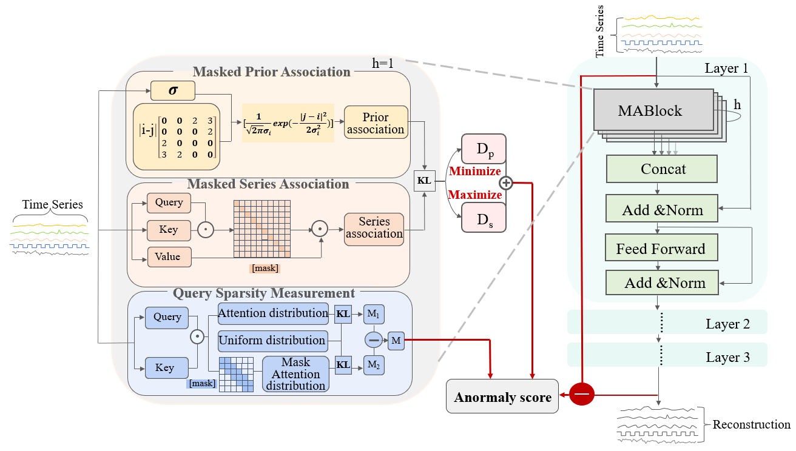
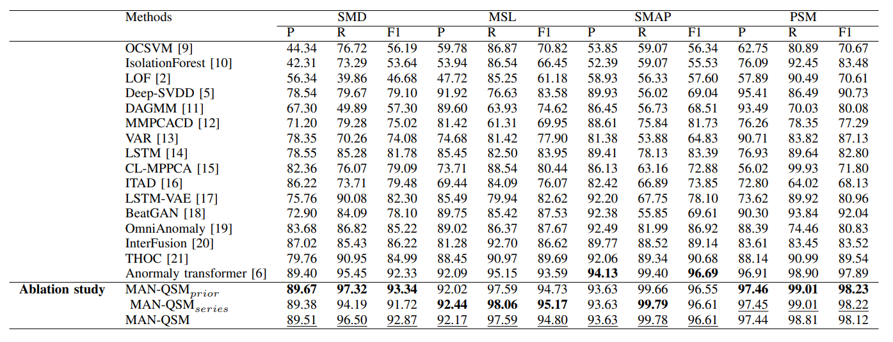

# MAN-QSM(ICME2023)
A masked attention network with query sparsity measurment for time series anomaly detection
We propose a masked attention network with Query Sparsity Measurement (MAN-QSM) for time series anomaly detection. We optimize the anomaly criterion by introducing prior knowledge of the difference between normal-abnormal self-attention score distribution and uniform distribution; on the other hand, we design the mask mechanism to amplify the normal-abnormal distinguishability under the synergy of the training strategy.

* Introduce the Query Sparsity Measurement (QSM) based on sequence dynamic information that can be generalized to various anomalies.
* Use the mask mechanism that effectively amplifies normal-abnormal distinguishability.
  
  

## Get Started
1.  Install Python 3.6, PyTorch >= 1.4.0. 
2.  Download data.
3.  Train and evaluate. We provide the experiment scripts of all benchmarks under the folder ./scripts.
## Main Result
We compare our model with 16 baselines.

## Citation
If you find this repo useful, please cite our paper.
```
@INPROCEEDINGS {10219872,
author = {J. Zhong and E. Zuo and C. Chen and C. Chen and J. Yan and T. Li and X. Lv},
booktitle = {2023 IEEE International Conference on Multimedia and Expo (ICME)},
title = {A Masked Attention Network with Query Sparsity Measurement for Time Series Anomaly Detection},
year = {2023},
volume = {},
issn = {},
pages = {2741-2746},
doi = {10.1109/ICME55011.2023.00466},
url = {https://doi.ieeecomputersociety.org/10.1109/ICME55011.2023.00466},
publisher = {IEEE Computer Society},
address = {Los Alamitos, CA, USA},
month = {jul}
}
```
## Contact
If you have any question, please contact zhongjiehk@163.com.
